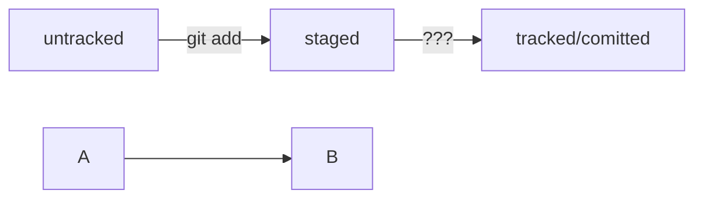
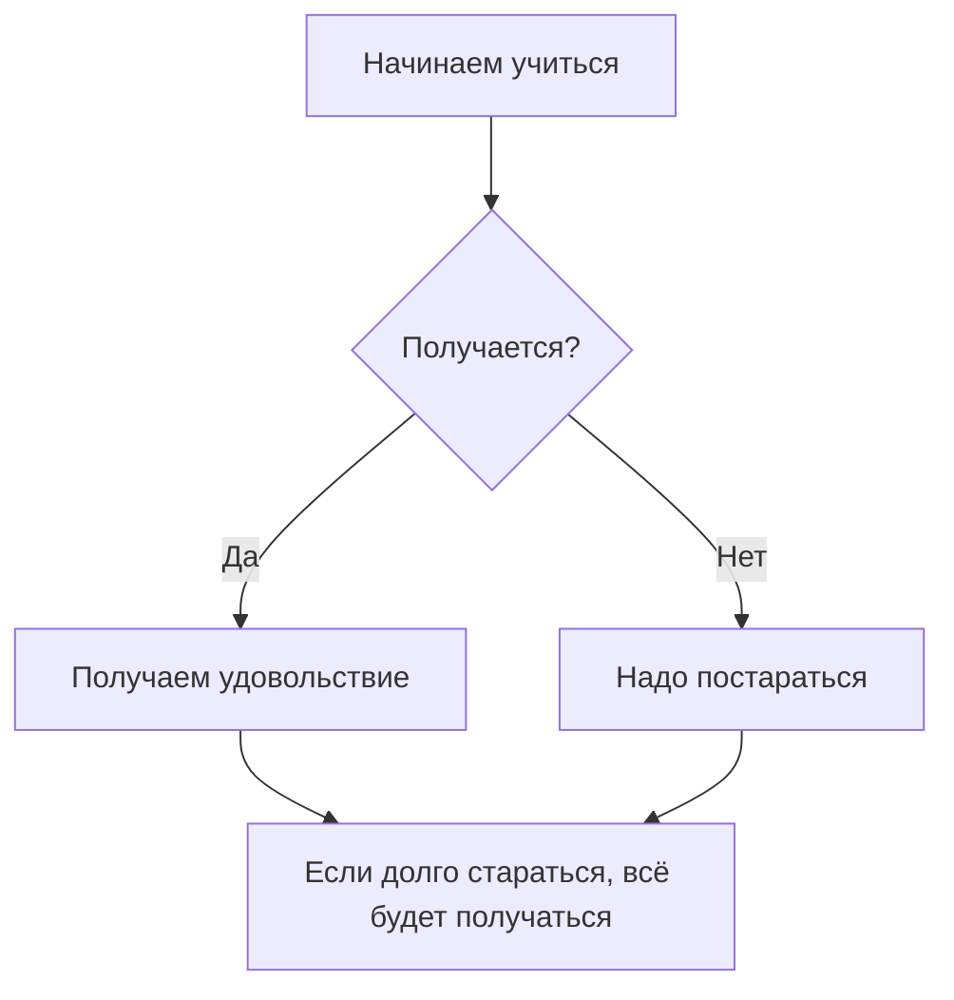

# Шпаргалка markdown

## Выделение текста

Вы можете выделять текст в markdown с помощью символов `_` или `*`. Например:

Пример _курсива_ и **жирного** текста.

## Заголовки

Заголовки можно создавать с помощью символа `#`. Чем больше `#`, тем меньше заголовок. Например:

# Заголовок первого уровня
## Заголовок второго уровня
### Заголовок третьего уровня

## Выделение кода

Чтобы выделить текст как код, поместите его в тройные кавычки `````. 

```
mkdir my_project
cd my_project
git init
```
Это лишь некоторые функции markdown.

# А теперь упражнение с GIT для проверки статусов

## Немного про hash
HASH позволяет идентификировать нужный коммит

## Немного про Log
LOG позволяет посмотреть историю коммитов

# Пробуем MERMAID диаграммы
## Ссылка на MERMAID вот тут https://github.blog/2022-02-14-include-diagrams-markdown-files-mermaid/

**HEAD** -- это голова.
**Коммит** -- это всему голова.
Статусы файлов:




# А теперь пробуем MERMAID flow




 